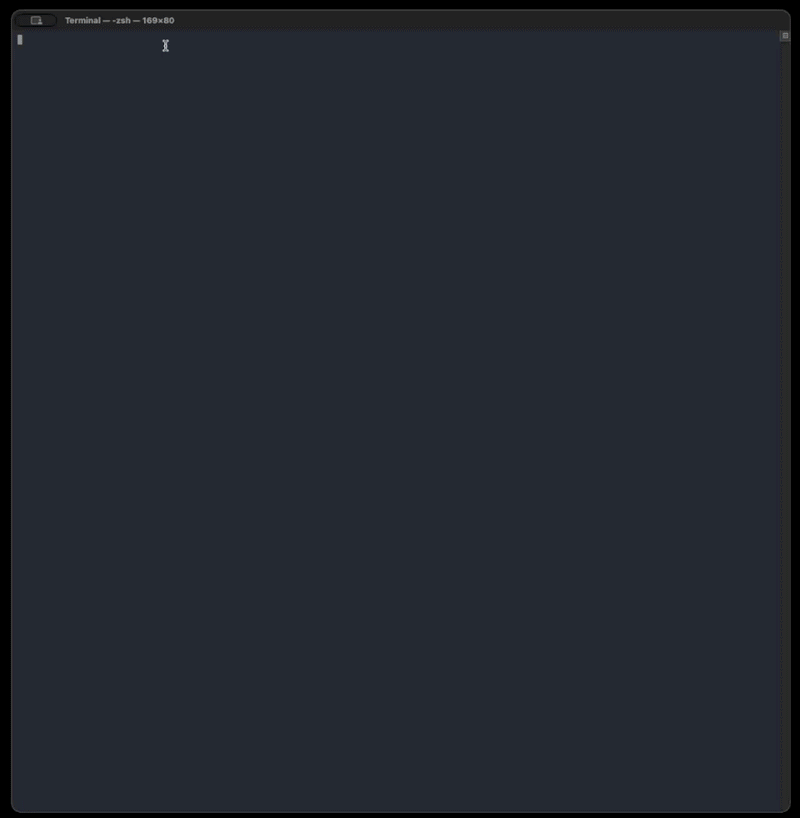

# ESP32-C5 Auto Flasher (AWOK)

Python-based auto flasher for ESP32-C5 devices. The script waits for the ESP32-C5 to appear as a **new** serial port, then flashes the required `.bin` files from the `bins/` folder using `esptool`.

---

## What this flasher does

- Auto-checks for required Python packages and installs them if missing (`pyserial`, `esptool`, `colorama`).
- Watches your system’s serial ports and waits until your ESP32-C5 shows up as a **newly connected** port.
- Validates required firmware components in `bins/`.
- Prompts for confirmation before flashing.

The script flashes at **921600 baud** and performs a **hard reset** after flashing.

---

## Requirements

- **Python 3.8+**
- `pip` (comes with most Python installs)
- USB-C to USB-A **data** cable (not charge-only)
- [Silicon Labs CP210x USB to UART Bridge Drivers](https://www.silabs.com/software-and-tools/usb-to-uart-bridge-vcp-drivers?tab=downloads)
- Firmware .bin file [Marauder](https://github.com/justcallmekoko/ESP32Marauder/releases)

Check Python:

```bash
python3 --version
```

---

## Folder layout

The script expects a `bins/` folder in the same directory as `c5_flasher.py`:

```text
C5_Py_Flasher/
  c5_flasher.py
  requirements.txt   (optional but recommended)
  bins/
    bootloader.bin
    partition-table.bin   (or partitions.bin)
    ota_data_initial.bin  (optional)
    your_firmware.bin     (app bin)
```

### Required files
- `bootloader.bin` (required)
- `partition-table.bin` **or** `partitions.bin` (required)

### Optional file
- `ota_data_initial.bin` (optional)

### App firmware selection (important)
The script automatically chooses the **largest** `.bin` file in `bins/` that is **not** the bootloader/partition/OTA file.  
So keep only the intended application `.bin` in `bins/` (or ensure it is clearly the largest).

---

## Flashing steps (the exact workflow)

1) **In your workstation CLI, navigate to the `C5_Py_Flasher` directory**
```bash
cd path/to/C5_Py_Flasher
```

2) **With your ESP32-C5 device unplugged, start the flasher**
```bash
python3 c5_flasher.py
```

- The script may install missing Python packages automatically.

3) **Wait for the prompt**
When you see:
```
Waiting for ESP32-C5 device to be connected...
```
connect your ESP32-C5 to your PC via USB-C to USB-A cable.

> If flashing an **AWOK Dual board**, make sure you connect the correct **color-coded USB‑C port** for the flasher you are running.

4) **Confirm flashing**
When you see:
```
Ready to flash these files to ESP32-C5? (y/N):
```
type:
```
y
```

5) **Disconnect when finished**
After flashing completes, the tool will reset the device. When you see the device reset / “hardware reset” behavior, you may disconnect your ESP32-C5.



---

## Troubleshooting

### 1) Python not found / command not working
Verify Python is installed:
```bash
python3 --version
```

### 2) Dependencies failing to install automatically
From inside `C5_Py_Flasher/`, run:
```bash
pip3 install -r requirements.txt
```

If `pip3` isn’t available, try:
```bash
python3 -m pip install -r requirements.txt
```

### 3) It keeps waiting and never detects the device
This script detects the ESP32-C5 only when it appears as a **new** serial port.

- Start the script **with the device unplugged**
- Use a known-good basic **data** USB-C to USB-A cable
- Try a different USB port on your computer
- If you plugged it in before running the script, unplug it and plug it back in (so it shows up as “new”)
- Make sure your USB to UART Drivers are installed and up-to-date
- Because you need to use a USB-C to USB-A cable some laptops or computers may only have USB-C ports available, you will want to use a USB hub that has a USB-C connection to the PC and at least one USB-A port on it. 

### 4) Wrong firmware gets selected
Because the script chooses the **largest** remaining `.bin` in `bins/`, ensure:
- Only one “app” `.bin` is present, **or**
- Your intended app `.bin` is clearly the largest in the folder

---

## Credits

- Script by [**AWOK**](https://awokdynamics.com)
- Inspired by [**LordSkeletonMan’s ESP32 FZEasyFlasher**](https://github.com/SkeletonMan03/FZEasyMarauderFlash)
- Shout out to [**JCMK**](https://github.com/justcallmekoko) for ESP32-C5 setup inspiration
